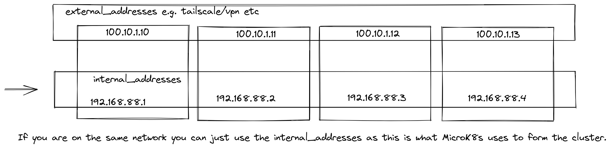

## microK8s-ansible

To run the installation perform the following activities

1. Modify the inventory file to include IP addresses of your hosts.
2. Confirm the `group_vars` for the hosts are correct.
3. Run `make` to run the playbook.

## Networks

By default I have set the makefile to target 'external_addresses' group
With the assumption that the hosts might have an external IP address e.g. tailscale.

If that's not true you can change the target group to 'local_addresses' in the makefile.



## Addons

Add your addons to be enabled in `group_vars/all`

```
enable_addons:
  - dns
```
